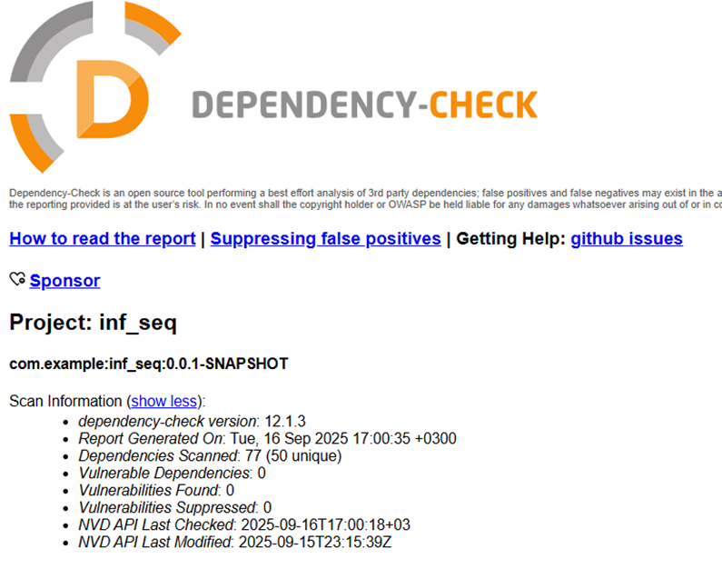
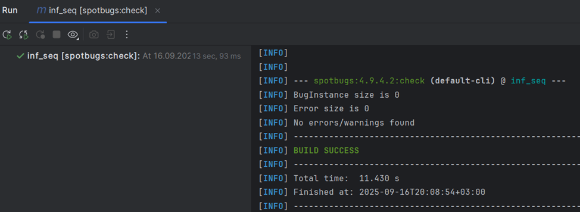

## Описание проекта

REST API на **Spring Boot** с **Hibernate** и **PostgreSQL**, обеспечивающее управление пользователями и аутентификацию через JWT.  

**Основные возможности:**
- Регистрация и логин пользователей
- Генерация JWT-токенов
- Защита всех эндпоинтов кроме `/api/auth/login` и `/api/auth/registration`
- Интеграция с PostgreSQL через Hibernate/JPA

---

## API

| Метод | Эндпоинт             | Описание                            | Доступ           |
|-------|----------------------|-------------------------------------|----------------|
| POST  | `/auth/registration` | Регистрация нового пользователя     | Public         |
| POST  | `/auth/login`        | Логин и получение JWT               | Public         |
| GET   | `/auth/me`           | Информация о пользователе из токена | Authenticated  |
| GET   | `/api/data`          | Получение списка пользователей      | Authenticated  |

##  Защита от SQL Injection (SQLi)

Для работы с базой данных используется **Hibernate (JPA)**:

- Автоматическая генерация SQL-запросов через ORM.
- Использование параметризованных запросов вместо конкатенации строк.
- Исключение возможности внедрения произвольного SQL-кода пользователем.

Таким образом, данные пользователя не попадают напрямую в SQL-запросы.

---

## Защита от XSS (Cross-Site Scripting)

Для предотвращения внедрения вредоносного JavaScript применяется **экранирование HTML**:

```java
public UserDTO(UserEntity user) {
    this.username = HtmlUtils.htmlEscape(user.getUsername());
    this.email = HtmlUtils.htmlEscape(user.getEmail());
    this.roles = user.getRoles();
}
```
Аналогично экранируются данные при формировании ответа:

```java
Map<String, Object> response = new HashMap<>();
response.put("username", HtmlUtils.htmlEscape(claims.getSubject()));
response.put("roles", claims.get("roles"));
response.put("expiration", claims.getExpiration());
```
Это предотвращает выполнение вредоносного кода при выводе данных, если злоумышленник внедрит скрипт в поля username или email.

---

##  Реализация аутентификации (JWT)

Аутентификация реализована с помощью **JSON Web Token (JWT)**.

###  JwtProvider
- Генерация токена при успешной аутентификации.
- Подпись токена секретным ключом.
- Добавление информации о пользователе и его ролях.
- Проверка подлинности и срока действия токена.

###  JwtFilter
- Перехват всех входящих запросов.
- Извлечение токена из заголовка `Authorization: Bearer <token>`.
- Проверка валидности токена.
- Установка объекта аутентификации в `SecurityContext`.

###  SecurityConfig
- Сессии не создаются: `SessionCreationPolicy.STATELESS`.
- Доступ к `/auth/login` и `/auth/register` открыт всем.
- Все остальные эндпоинты доступны только после аутентификации.  

### Хранение паролей

Пароли хэшируются с использованием **BCryptPasswordEncoder**, что обеспечивает защиту от атак перебором (brute force) за счёт соли и регулируемой сложности вычислений:

```java
@Bean
public PasswordEncoder passwordEncoder() {
    return new BCryptPasswordEncoder();
}
```
---

##  Скриншоты SAST / SCA

Скриншоты статического анализа кода (**SAST**) и анализа уязвимостей зависимостей (**SCA**) находятся в разделе:  

### Отчет OWASP Dependency-Check


### Отчет SpotBugs

 
